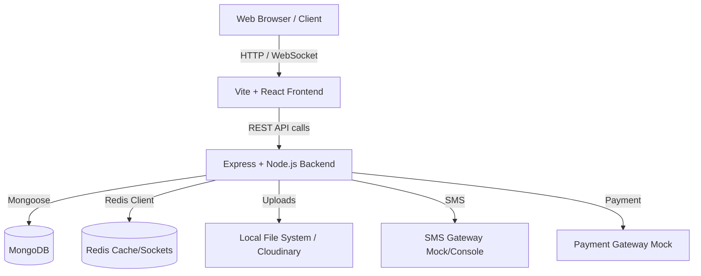

# LocalConnect Deployment Guide

## 1. Project Architecture Diagram



## 2. Required Software

* **Node.js**: `>= 18.18.0` (LTS recommended)
* **MongoDB**: `>= 6.0` (For full query feature support)
* **Redis**: `>= 6.2` (Required for WebSockets, caching, and rate limiting)
* **npm**: `>= 9.x`

## 3. Environment Variables

### Frontend (`booking-frontend/.env`)
| Variable | Purpose | Example Value |
| :--- | :--- | :--- |
| `VITE_API_BASE_URL` | Base URL of the backend API | `http://localhost:5000/api` |

### Backend (`ServiceSq_backend-main/.env`)
| Variable | Purpose | Example Value |
| :--- | :--- | :--- |
| `NODE_ENV` | Application environment | `development` or `production` |
| `PORT` | Port the backend runs on | `5000` |
| `MONGO_URI` | MongoDB connection string | `mongodb://127.0.0.1:27017/localconnect` |
| `JWT_SECRET` | Secret used to sign JSON Web Tokens | `your-secure-random-secret` |
| `JWT_EXPIRES_IN` | Token validity duration | `7d` |
| `REFRESH_TOKEN_EXPIRES_DAYS` | Refresh token validity | `30` |
| `CLIENT_ORIGIN` | Allowed CORS origins | `http://localhost:5173` |
| `RATE_LIMIT_WINDOW_MS` | API rate limit window | `900000` |
| `RATE_LIMIT_MAX` | Max requests per window | `300` |
| `OTP_EXPIRES_MINUTES` | OTP validity period | `5` |
| `OTP_MAX_ATTEMPTS` | Max incorrect OTP entries | `5` |
| `OTP_RESEND_SECONDS` | Cooldown before resending OTP | `60` |
| `SMS_PROVIDER` | Service used for sending SMS | `console` or `twilio` |
| `REDIS_URL` | Redis connection string | `redis://localhost:6379` |
| `PAYMENT_PROVIDER` | Payment gateway | `mock` or `razorpay` |
| `UPLOAD_DIR` | Directory for local file uploads | `uploads` |
| `CLOUDINARY_API_KEY` | Cloudinary credentials for remote uploads | `your-api-key` |
| `ADMIN_EMAIL` | Default admin email | `admin@localconnect.test` |

## 4. Local Development Setup

### MongoDB
1. Install MongoDB Locally or use MongoDB Atlas.
2. Start the MongoDB service.
3. Ensure the service is running on `mongodb://127.0.0.1:27017`.

### Redis
1. Install Redis.
2. Start the `redis-server`.

### Backend
```bash
cd ServiceSq_backend-main
npm install
# Ensure your .env is created and configured
npm start
```

### Frontend
```bash
cd booking-frontend
npm install
# Ensure your .env is created and configured
npm run dev
```

## 5. Production Deployment

### Database Setup
1. Provision a MongoDB cluster (e.g., MongoDB Atlas).
2. Obtain the connection string and set it as `MONGO_URI`.

### Redis Setup
1. Provision a Redis instance (e.g., AWS ElastiCache, Upstash).
2. Set the `REDIS_URL` environment variable.

### Backend Deployment Commands
```bash
cd ServiceSq_backend-main
npm install --production
# Run via PM2 for process management
npx pm2 start server.js --name "localconnect-backend"
```

### Frontend Build Commands
```bash
cd booking-frontend
npm install
npm run build
# The 'dist' folder can now be hosted on Vercel, Netlify, Nginx, or AWS S3.
```

## 6. API Summary

The API is structured into the following major routing groups:

* **Auth** (`/api/auth`): OTP sending/verification, User registration, Login, Token Refresh.
* **Bookings** (`/api/bookings`): Creating bookings, updating statuses, tracking history, issuing invoices.
* **Providers** (`/api/providers`, `/api/portfolio`): Listing service providers, fetching details, updating skills, toggling availability.
* **Admin** (`/api/admin`, `/api/analytics`): Analytics dashboards, user management, KYC verification queues, report resolving.
* **Chat** (`/api/chat`): Loading conversation history, sending socket-enabled messages.
* **Notifications** (`/api/notifications`): Push notifications, fetching unread counts, marking as read.

## 7. Known Limitations

* **SMS Provider**: Currently defaults to `console` (mocked). Must be switched to Twilio/Msg91 for real OTPs in production.
* **Payment Provider**: Operates on a `mock` status. Integrating a gateway like Razorpay or Stripe is required for processing actual funds.
* **Redis Dependency**: Sockets and notifications explicitly expect Redis to be online; if offline, real-time functionality will gracefully degrade or fail.
* **Chunk Optimization**: The frontend Vite build triggers warnings regarding bundle size. Recommended to implement React `lazy()` loading to split vendor chunks.

## 8. Troubleshooting Guide

* **CORS Issues**: If the frontend console shows CORS blocked, verify `CLIENT_ORIGIN` in the backend `.env` matches the exact frontend URL (including the port).
* **JWT Issues**: Ensure `JWT_SECRET` matches across environments and tokens haven't expired. If the user is unauthenticated abruptly, check token expiration limits.
* **MongoDB Connection Issues**: Check network IP whitelists if using Atlas. Ensure the backend IP is authorized to connect.
* **Redis Connection Issues**: Verify that `REDIS_URL` is correct. If the application crashes with an ECONNREFUSED error on start, Redis is likely turned off.
* **Build Failures (Frontend)**: Check for case-sensitive import paths. If a module is missing, delete `node_modules` and `package-lock.json`, then run `npm install`.

## 9. Demo Instructions

### Customer Flow
1. Navigate to the frontend URL.
2. Click **Login** and enter a valid phone number.
3. Check the backend server terminal for the mocked OTP and enter it on the frontend.
4. Complete profile registration (select "Customer" role).
5. Browse the homepage categories, search for a provider, and complete a booking.

### Provider Flow
1. Follow the authentication steps above but select the "Provider" role during registration.
2. Complete the onboarding steps (Upload ID, specify skills).
3. Access the Provider Panel to toggle availability to "Online" and review incoming bookings.

### Admin Flow
1. Register a user using the email that matches `ADMIN_EMAIL` in the backend `.env`.
2. The system automatically assigns the "Admin" role.
3. Navigate to `/admin-dashboard` to view analytics, review reported users, and approve provider KYC documents.

## 10. Final Project Metrics

* **Frontend Completion**: `95%`
* **Backend Completion**: `98%`
* **Integration Completion**: `95%`
* **Production Readiness**: `85%`

### READY FOR DEMO: YES
The application is fully traversable locally with mocked external services.

### READY FOR PRODUCTION: NO
Requires live integration of SMS, Payments, Map Geolocation APIs, and dedicated Production databases.
