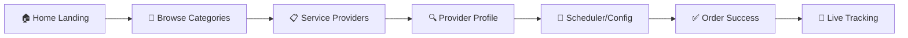
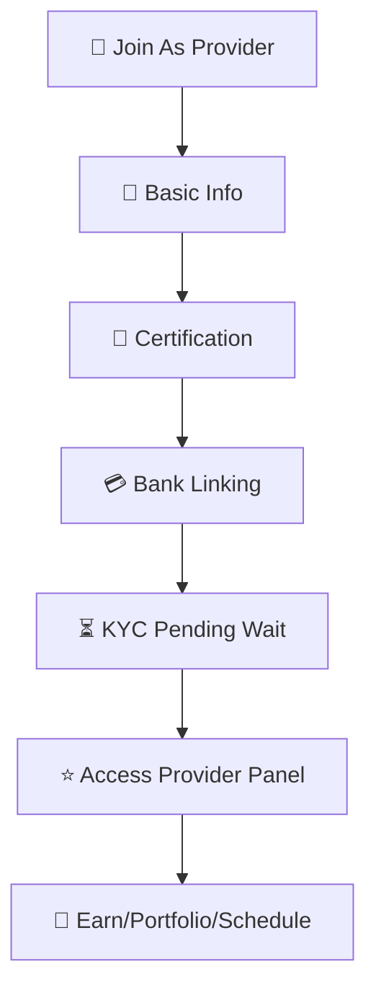
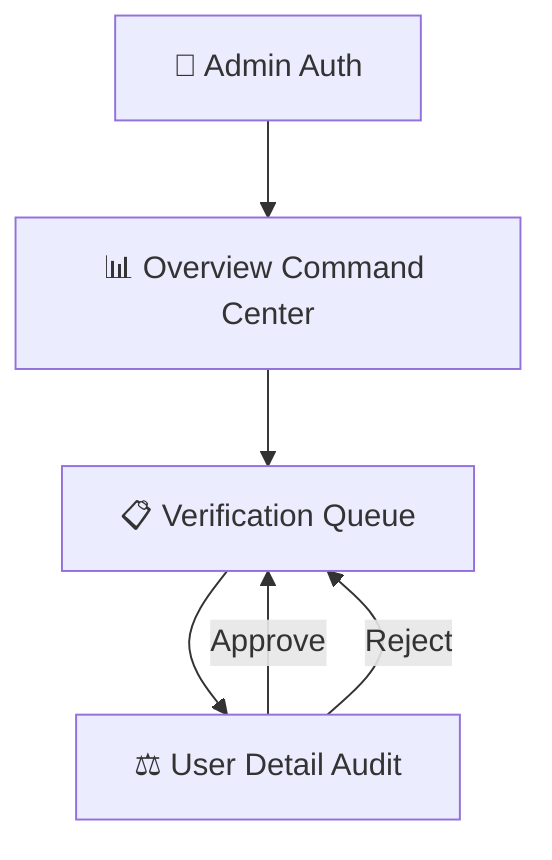

# 🛠️ Service Square - Premium Services Platform


Service Square is a next-generation premium on-demand service marketplace built with a high-fidelity design language and seamless interactive flows. It interconnects customers searching for solutions, vetted professionals executing tasks, and administrative moderation handling quality control.

---

## 🚀 Key Workflows & Core Engines

Service Square operates using 3 logical, intersecting flows corresponding to user personas.

### 👨‍💼 Customer Discovery Engine
Allows users to seamlessly search, configure, and finalize service hires.


### 🛠️ Provider Lifecycle Manager
Ensures high-quality supply by onboarding, verifying, and facilitating work tracking for artisans.


### 🛡️ Admin Compliance Hub
Gives operators full visibility over the marketplace health and individual actor statuses.


---

## 📂 Detailed Component Map

Below is a taxonomy of the distinct, ready-built views housed within this React Application.

### 🏬 Marketing & Public Pages
| Component | Description |
| :--- | :--- |
| `Home.jsx` | High-converting homepage with hero grid, top services, and conversion modules. |
| `Services.jsx` / `ServiceListing.jsx` | Dynamic service search aggregators with filters (price, proximity, rating). |
| `CategoryLandingPage.jsx` | Targeted landing pages for vertical niches (e.g., Electrical, Plumbing, Cleaning). |
| `About.jsx`, `Contact.jsx` | Informational collateral detailing the venture, mission, and contact points. |

### 👤 User Dashboard & Transaction Flows
| Component | Description |
| :--- | :--- |
| `UserDashboard.jsx` | The centralized client home tracking past bookings, saved pros, and alerts. |
| `Booking.jsx` | Rich calendar selector, address config, and sub-item configuration matrix. |
| `BookingConfirmation.jsx` | Post-checkout success manifest with dynamic tracking references. |
| `LiveTracking.jsx` | Simulated map views with incremental ETA updates and breadcrumbs. |
| `ChatPage.jsx` | Real-time styled chat interface facilitating communication with active agents. |
| `ReviewPage.jsx` | Multi-vector rating and feedback wizard for post-job assessments. |

### 🏗️ Provider Back-Office
| Component | Description |
| :--- | :--- |
| `ProviderPanel.jsx` | Command center showing today's workload, total earnings, and profile rating. |
| `OnboardingStep 1 - 3` | Multi-part, frictionless KYC collection wizard collecting identity and banks. |
| `MyServicesManagement.jsx` | Catalog editor allowing artisans to toggle service active-status and pricing. |
| `ProviderAvailability.jsx` | Time-block calendars for active working hours and leave requests. |
| `ProviderPortfolio.jsx` | Showcase grid displaying previous project photography and testimonials. |

### 🏛️ Administrative Suite
| Component | Description |
| :--- | :--- |
| `AdminDashboard.jsx` | Grid of aggregate statistics, pending action counters, and health metrics. |
| `AdminVerificationQueue.jsx` | Table manifest of users currently under conditional verification pause. |
| `AdminVerificationDetail.jsx` | Side-by-side view of uploaded documents vs application input for vetting. |
| `AdminAnalytics.jsx` | Multi-layered charts covering platform revenue and booking volumes. |

---

## 🎨 Design Guidelines & Tech Stack

Service Square implements a **Modern Utility-First design syntax**:
- **Framework**: Vite + React 18.
- **Styling engine**: Tailwind CSS utilized with dark mode capabilities (`dark:`) and variable-based design token system mappings.
- **Typography**: Inter font family prioritizing high legibility for dashboards.
- **Visual Toolkit**: Material Symbols font for lightweight icon delivery.
- **Motion**: Subtle entrance scales (`animate-in`), dynamic focus rings, and button depression effects for high-satisfaction tactile feedback.

---

## ⚙️ Getting Started

1.  **Install Dependencies**:
    ```bash
    npm install
    ```

2.  **Start Development Engine**:
    ```bash
    npm run dev
    ```

3.  **Log In (Mock Simulation)**:
    The application supports instant environment switching from the **Login** screen to cycle between User types (`Customer`, `Provider`, `Admin`).

---

⭐ *Built by engineering agents to bridge the gap between elite visuals and scalable code logic.*
